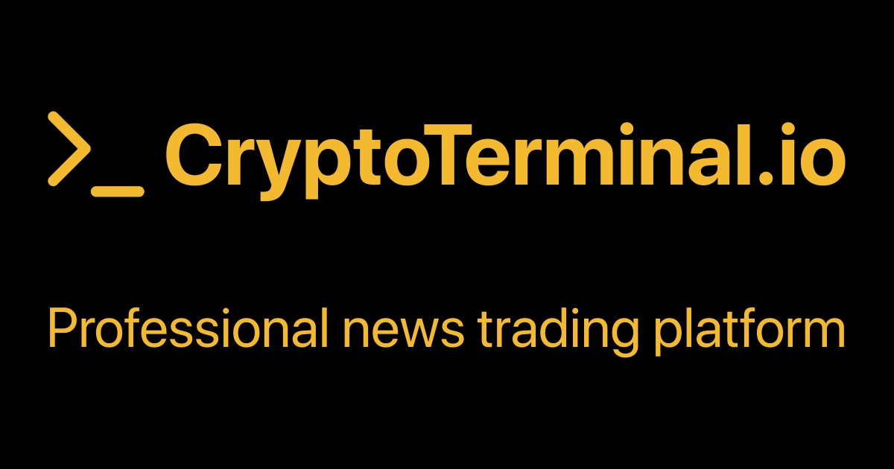
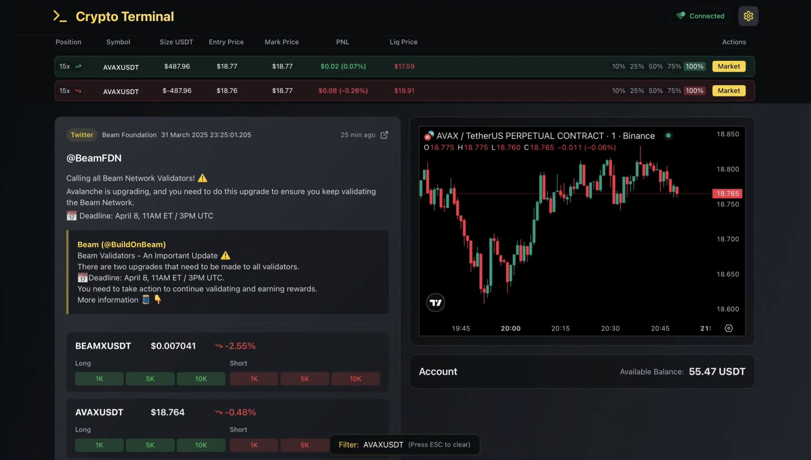

# Crypto Terminal

Crypto Terminal is a modern web application developed for tracking cryptocurrency markets, executing trades, and viewing real-time crypto news.

# Project Demo

https://cryptoterminal.io



## 📹 Demo Video

[](https://raw.githubusercontent.com/zomyzox/Crypto-Terminal-Binance-News-Trading/refs/heads/main/demo/video.mp4)

## 🚀 Features

- **Real-Time Crypto News**: Get instant news about the cryptocurrency ecosystem
- **Binance Futures Integration**: Connect to your Binance Futures account to view positions and execute trades
  - Support for both Mainnet and Testnet
  - Position Mode settings (One-way/Hedge mode)
  - Cross and Isolated margin configuration per symbol
  - Customizable leverage for each symbol
- **TradingView Charts**: Analyze market movements with professional charts
- **Command Interface**: Quick access with keyboard shortcuts and command palette (Spotlight)
- **Customizable Interface**: Configure position mode and other settings according to your preferences
- **Responsive Design**: Works seamlessly on both desktop and mobile devices
- **Interactive News Feed**:
  - Click on symbols to open Binance Futures pages
  - Click on symbol prices to open TradingView charts

## 🛠️ Technologies

- **Frontend**: React + TypeScript + Vite
- **Styling**: TailwindCSS
- **API Connections**: WebSocket, RESTful API
- **Security**: TweetNacl, Crypto-JS

## 🔌 API & WebSocket

### News API

- **Historical News**: `https://api.cryptoterminal.io/news?limit=1000`
- **Real-time News**: `wss://ws.cryptoterminal.io`

### Data Structure

```json
{
  "id": "b0b8c203-92ff-4c41-a6f8-79b31d6573e7",
  "source": "Twitter",
  "sourceName": "TON 💎",
  "title": "@ton_blockchain",
  "description": "Proud to unveil the Telegram Bond Fund ($TBF) with @librecap. \n\nBringing regulated access to Telegram-issued bonds directly on the $TON Blockchain. \n>>QUOTE LibreCapital (@librecap)\n We're thrilled to announce that Libre is partnering with the @ton_blockchain to launch the $500M Telegram Bond Fund ($TBF) tokenizing access to Telegram-issued bonds for institutional and accredited investors. 🧵👇\n\n#RWAs #TON #TBF ",
  "url": "https://twitter.com/ton_blockchain/status/1917570001931796846",
  "symbol": "TONUSDT",
  "timestamp": "1746019290122"
}
```

## 🚦 Getting Started

### Requirements

- Node.js 16.x or higher
- npm or yarn

### Installation

```bash
# Clone the repository
git clone https://github.com/zomyzox/Crypto-Terminal-Binance-News-Trading.git
cd Crypto-Terminal-Binance-News-Trading

# Install dependencies
npm install
# or
yarn install

# Run in development mode
npm run dev
# or
yarn dev
```

The application will run at `http://localhost:5173` by default.

### Deployment

```bash
# Build production version
npm run build
# or
yarn build

# Preview production build
npm run preview
# or
yarn preview
```

## 💼 Usage

1. **News Interface**:
   - View crypto news on the main screen and enter a symbol for filtering
   - Click on a symbol name to open the corresponding Binance Futures page
   - Click on a symbol price to open the TradingView chart for that symbol
   - Start typing on the homepage to activate the Spotlight search

2. **Trading Configuration**:
   - Choose between One-way and Hedge position mode
   - Configure trade buttons for all symbols at once
   - Set cross/isolated margin mode for each symbol individually
   - Adjust leverage settings for each trading pair

3. **Binance Integration**:
   - Connect to your Binance Futures account (Mainnet or Testnet)
   - Manage your positions and view real-time updates
   - Execute trades directly from the interface

4. **Command Interface**:
   - Use the Spotlight feature to enter quick commands (e.g., "LONG BTC 1000" or "SHORT ETH 500")

## 🔒 Security

The application operates entirely client-side for Binance API integration. Users must configure IP permissions on their Binance API keys to allow access from their own IP addresses. **No API keys are ever stored on any server**, and all sensitive information is encrypted locally using TweetNacl and Crypto-JS.

## 🚧 Future Development Roadmap

- **AI-Powered News Analysis**: Training artificial intelligence models specifically for crypto news trading analysis
- **Automated Market Scanner**: All market scanning with order flow analysis for automated trade execution and optimal entry point identification, with detailed periodic candle pattern analysis for market trends
- **Expanded Exchange Support (CEX & DEX)**: Integration with additional exchanges including Bybit, OKX, Bitget, and Hyperliquid
- **Dedicated Server Security**: Security with individual servers assigned to each user for 24/7 market analysis and signal generation
- **Advanced Risk Management**:
  - Automatic take profit functionality at pre-defined percentage gains
  - Automatic stop loss implementation at specified percentage losses
- **Multiple language support**: More than 40 languages support

## 💰 Funding & Support

Developing and maintaining Crypto Terminal—especially advanced features like AI-powered analysis, automated trading systems, and dedicated server infrastructure—requires significant time and resources.
If you find this project valuable and would like to support its continued development, consider sponsoring or contributing financially.

## 📞 Contact

- **X**: [@zomyzox](https://x.com/zomyzox)
- **Email**: contact@zomyzox.dev
- **GitHub Issues**: [Report bugs or request features](https://github.com/zomyzox/Crypto-Terminal-Binance-News-Trading/issues) 

## 📚 License

This project is licensed under the MIT License. See the `LICENSE` file for more information.

## 👨‍💻 Contributing

Contributions are welcome! Please open an issue to discuss your changes before submitting a pull request.